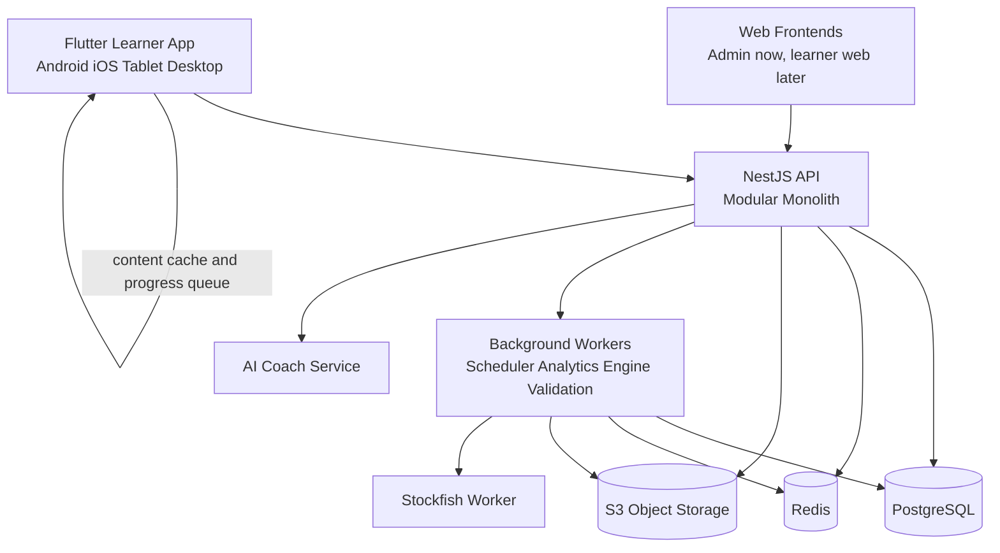
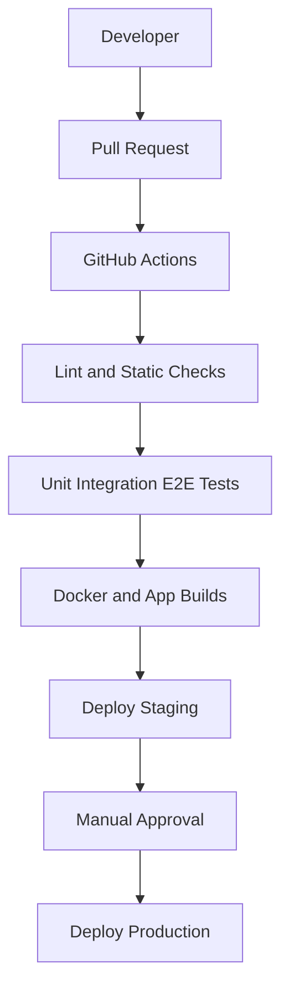

# Architecture Blueprint

## Product Goal

Build a cross-platform training product that teaches chess opening traps through repetition and adaptive practice. The system should optimize for:

- cross-platform mobile delivery with a backend shared by all first-party clients
- a first-class learner web app on the same backend and content model
- offline practice and deferred synchronization
- versioned training content
- recommendation quality that improves with user history
- backend boundaries that can scale without a rewrite

## Non-Goals

- real-time engine analysis on every move
- a full chess database product
- a general tactics platform competing on breadth instead of opening-trap depth

## System Topology



## Why This Shape

The right starting point is not microservices. It is a modular monolith with strict domain boundaries, separate worker processes, and explicit event contracts. That gives you:

- one deployable backend while the team is small
- simpler transactions for progress, reviews, and catalog state
- straightforward observability and lower operational cost
- a clean path to split high-load modules later

Split services only when a domain has independent scale, release cadence, or runtime needs. The likely first separations are analytics ingestion, engine validation, and notifications.

## Shared Backend Rule

Use one backend for all first-party clients:

- Flutter mobile app for Android and iOS
- current React web admin
- future learner-facing web frontend if one is added

The shared backend owns authentication, catalog delivery, practice evaluation, review scheduling, progress sync, and recommendations. Do not create separate mobile and web backends during the MVP or early growth stages.

Client differences should live in the frontend layers:

- mobile keeps offline storage, outbox sync, and device-centric UX
- web keeps browser navigation, admin workflows, and desktop-oriented layouts
- both consume the same API contracts and domain rules

If a web-specific BFF is ever added later, it should remain a thin aggregation layer rather than a second source of business logic.

## Client Architecture

### Client Surfaces

- Flutter is the primary learner client for Android and iOS
- Next.js provides the learner-facing web client
- React web surfaces support admin workflows
- all first-party clients consume the same NestJS backend

### Version 1 Product Scope

The first release should stay intentionally narrow:

- black traps against white only
- 10 curated traps with strong instructional value
- guided lesson tours before free practice
- adaptive review and progress tracking

This keeps the product focused on a coherent learning loop instead of broad chess coverage.

### Stack

- Flutter for Android, iOS, tablet, desktop, and web reach
- Riverpod for predictable state management
- Drift on SQLite for local relational persistence
- secure key-value storage for tokens and lightweight preferences
- Dio for HTTP and sync transport
- `go_router` for navigation
- Firebase Cloud Messaging for notifications
- Firebase Crashlytics for crash reporting
- `chess.dart` for chess rules and move legality in the client

### Feature Modules

- auth
- dashboard
- openings
- traps
- practice
- reviews
- recommendations
- profile
- subscriptions

Each feature owns its UI, application use cases, repositories, and local models. Shared code stays small and explicit: chessboard rendering, design system, sync primitives, and network contracts.

### Offline-First Model

The mobile app should be fully usable for the core training loop while offline.

Store locally:

- opening catalog metadata
- trap definitions and scenario trees
- FENs, PGNs, hints, and explanations
- user review queue and progress snapshots
- practice attempts waiting for sync

The app should use an outbox pattern:

1. write attempts and progress changes to local storage first
2. mark them as pending sync
3. sync in the background when connectivity returns
4. reconcile server acknowledgements and clear the outbox

Conflict policy:

- catalog content is server authoritative and versioned
- user progress merges through append-only attempt events rather than blind record overwrites
- derived review state is recomputed server-side when authoritative events arrive

This avoids the usual offline bug where last-write-wins destroys learning history.

### Real-Time and Sync Boundaries

Use transport types deliberately instead of defaulting to every protocol everywhere.

- REST: primary interface for auth, catalog, progress sync, review fetches, and recommendations
- WebSocket: optional for live challenges, multiplayer race modes, and coach presence later
- GraphQL: optional read layer for aggregated dashboards or back-office tooling, not for the offline sync path

This keeps the mobile client simple while leaving room for richer real-time features in later phases.

## Backend Architecture

### Stack

- NestJS for API and domain modules
- TypeScript as the backend language
- Prisma as the primary ORM
- PostgreSQL for relational core data
- Redis for caching, rate limits, queues, and scheduled jobs
- BullMQ or equivalent worker queue
- S3-compatible storage for bundled assets and content manifests
- OpenAPI for contract documentation

Recommended managed services for the MVP:

- Firebase Auth for user authentication unless there is a strong reason to centralize identity elsewhere
- Firebase Cloud Messaging for push delivery
- CloudFront or equivalent CDN in front of content manifests and assets

## Core Modules

### Auth

- identity, sessions, device registration, subscription entitlements

### Catalog

- openings, traps, scenarios, motifs, collections, content releases

### Lessons

- lesson tours, guided steps, quizzes, and trap explanations

### Practice

- move validation against scenario trees
- attempt capture
- mistake classification

### Progress

- user statistics, mastery snapshots, streaks, accuracy, and practice history

### Review Scheduler

- spaced repetition state per trap or scenario
- due-card generation
- review interval adjustment

### Recommendation Engine

- weakness clustering by opening, motif, and error pattern
- next-best-trap recommendations

### Gamification

- XP, levels, achievements, challenges, and leaderboards

### Analytics

- event ingestion, funnels, retention, and learning effectiveness metrics

### Notifications

- push scheduling for due reviews, streak saves, and challenges

### Payments

- subscription entitlements, purchase events, and plan access checks

### AI Coach

- natural-language explanations and personalized study recommendations

## API Style

Prefer REST for core mobile sync flows. Offline systems benefit from explicit resource versions, sync tokens, idempotent event submission, and cache-friendly endpoints.

Recommended REST surface:

- `GET /catalog/releases/current`
- `GET /catalog/releases/:id/manifest`
- `GET /openings`
- `GET /openings/:id`
- `GET /traps?openingId=&difficulty=`
- `GET /traps/:id`
- `GET /traps/:id/lesson`
- `GET /traps/:id/practice`
- `GET /reviews/due`
- `GET /leaderboard`
- `POST /practice/start`
- `POST /practice/move`
- `POST /practice/finish`
- `POST /practice-attempts:batch`
- `POST /progress/sync`
- `POST /analytics/session`
- `GET /recommendations/today`

Later interfaces:

- WebSocket channels for challenge state, leaderboards, and multiplayer sessions
- GraphQL read models for composite dashboard queries if mobile read orchestration becomes too chatty

GraphQL is reasonable later for dashboard aggregation or internal tooling, but it should not be the first solution for offline sync.

The same REST surface should serve both mobile and web clients. Differences in presentation or caching do not justify separate backend implementations.

## Data Model

### Content Entities

- `opening`: name, ECO code, side, popularity
- `trap`: opening reference, title, difficulty, rating band, motifs
- `scenario`: starting FEN, side to move, canonical line, failure branches, hint ladder, explanation
- `content_release`: version, checksum, publication status, migration notes

### User Learning Entities

- `user_progress`: denormalized mastery summary per trap
- `review_card`: scheduling state per trap or scenario
- `practice_attempt`: raw event with move sequence, mistakes, completion, timing, and device metadata
- `weakness_snapshot`: aggregated user weaknesses by opening, motif, and move number
- `daily_streak` and `achievement_unlock`

### Suggested Relational Shape

```text
users
devices
refresh_tokens
openings
traps
trap_motifs
scenarios
scenario_moves
scenario_wrong_moves
content_releases
user_progress
review_cards
practice_attempts
practice_attempt_moves
weakness_snapshots
challenge_entries
subscription_entitlements
notification_deliveries
audit_logs
```

The key design choice is to store both derived progress and raw attempts. Derived progress powers fast reads. Raw attempts preserve the event history needed for recomputation, analytics, and model improvements.

## Review Scheduling

Use an FSRS-style scheduler instead of classic SM-2. It is better suited to tuning interval growth from actual user performance.

If the team needs a lower-complexity fallback for an ultra-fast prototype, SM-2 is acceptable temporarily, but the target production scheduler should remain FSRS.

Signal inputs:

- correct or incorrect completion
- number of mistakes
- hint usage
- response time
- confidence rating if you later add self-assessment

Scheduling unit:

- start with trap-level scheduling for simplicity
- support scenario-level scheduling under the same abstraction so hard branches can surface independently later

## Recommendation Engine

The recommendation engine should sit above the scheduler, not replace it.

Scheduler decides:

- what is due
- when it is due

Recommendation engine decides:

- what else should be introduced today
- what weak openings or motifs need more coverage
- which content should be suppressed because mastery is already stable

Initial recommendation features:

- recent failure rate by opening
- failure clusters by motif
- trap difficulty vs user success band
- review backlog pressure
- practice recency

This is enough to produce Duolingo-style daily sequencing without premature machine-learning complexity.

## AI Coach Strategy

The AI layer should explain ideas, not replace the curated curriculum.

Use AI for:

- converting structured trap data into plain-language explanations
- summarizing recurring user mistakes
- generating coaching prompts such as "practice Italian traps where you miss overloaded-piece motifs"

Do not place the LLM on the critical practice path. The core trap playback and answer validation must work offline and without AI availability.

## Content Pipeline

Treat content as a product, not static seed data.

Pipeline stages:

1. authored trap line or imported PGN
2. normalized scenario representation
3. engine validation and quality checks
4. editorial review and tagging
5. packaged content release with checksum and version
6. client sync by release manifest

This enables a future creator platform without sacrificing quality control.

## Search Strategy

Do not add Elasticsearch in the MVP unless you prove catalog or creator-platform search has outgrown PostgreSQL full-text search. It becomes useful when you need:

- typo-tolerant search across large public collections
- ranking by popularity, freshness, and coach reputation
- faceted search across motifs, openings, difficulty, and author metadata

Until then, PostgreSQL keeps the platform simpler to operate.

## Analytics and Observability

Track both product and learning metrics.

Product metrics:

- activation to first completed trap
- day-1, day-7, day-30 retention
- subscription conversion

Learning metrics:

- review recall rate by interval band
- mastery growth by opening family
- hint dependency rate
- repeated mistake motifs

Operational metrics:

- sync latency
- outbox failure rate
- content download success rate
- scheduler job latency

Recommended runtime tooling:

- Prometheus for metrics
- Grafana for dashboards
- Loki or a managed log platform for structured logs

## Security and Platform Concerns

- use managed auth early to reduce account-security overhead
- issue device-scoped refresh semantics to support safe multi-device sync
- encrypt sensitive local data at rest where platform support exists
- sign content manifests to prevent corrupted or tampered releases
- make analytics events privacy-aware and avoid logging full user PGNs unless necessary
- rotate refresh tokens and track revocation by device
- apply rate limits and abuse controls to auth, practice submission, and AI endpoints
- keep secrets in a managed vault such as AWS Secrets Manager

## Testing Strategy

### Mobile

- unit tests for schedulers, repositories, and sync policy
- widget tests for key flows such as dashboard, practice, and review
- integration tests for offline-to-online synchronization

### Backend

- unit tests for domain modules
- integration tests for Prisma persistence and queue-backed workflows
- end-to-end tests for auth, catalog, practice submission, and review generation

### Contracts and Performance

- API contract tests between mobile and backend schemas
- load tests for attempt ingestion, review fetches, and recommendation generation

## Delivery Pipeline



Baseline CI/CD expectations:

- GitHub Actions for automation
- containerized API and workers
- internal mobile distribution through Firebase App Distribution or platform-native internal testing tracks
- infrastructure described in code before production scaling starts

## Delivery Phases

### Phase 1: Product-Market-Fit MVP

- email or social auth
- opening catalog
- trap practice player
- local progress persistence
- due reviews
- basic recommendations
- streaks and XP

### Phase 2: Premium Learning Layer

- AI explanations
- advanced analytics
- custom collections
- import from Chess.com and Lichess

### Phase 3: Platform Expansion

- coach accounts
- academy dashboards
- creator marketplace
- multiplayer challenges

### Phase 4: Advanced AI and Device Expansion

- AI-assisted scenario generation
- voice coaching
- wearable experiences where justified

## Scalability Plan

### 0 to 10,000 users

- Flutter client
- NestJS modular monolith
- PostgreSQL primary
- Redis for queues and cache
- S3-compatible storage

### 10,000 to 100,000 users

- read replicas for reporting-heavy workloads
- dedicated background workers for analytics, recommendations, and notifications
- CDN-backed content delivery
- optional search tier if discovery becomes material

### 100,000 to 1,000,000+ users

- split independent services only where load or ownership justifies it
- event streaming for high-volume analytics and asynchronous fan-out
- Kubernetes or equivalent orchestrator if operational scale demands it
- multi-region deployment only when latency, resilience, and revenue justify the complexity

## Recommended First Implementation Slice

Build one complete vertical slice before broadening scope:

1. Flutter practice flow for one opening family
2. local storage for catalog, attempts, and review cards
3. NestJS endpoints for catalog fetch and attempt sync
4. FSRS scheduling job
5. dashboard showing due reviews, streak, and recommendations

That slice exercises the hardest architectural requirements early: offline support, sync correctness, review logic, and cross-platform UI.